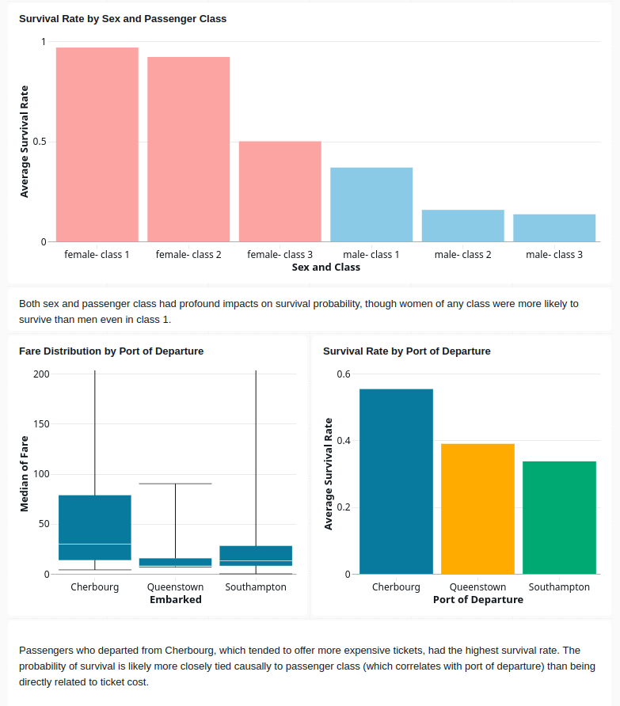

# Titanic project

Using the well-known titanic dataset, my goals were to practice data-engineering
skills in Databricks. I gained experience with the lakehouse architecture, Unity
Catalog, Delta tables, the bronze -> silver -> gold model, warehouse-style
querying in the SQL Editor, dashboards, and orchestrating ETL pipelines with
Databricks workflows.

## The workflow

Overall, this project involved building and orchestrating an ETL pipeline to
ingest the titanic dataset, transform and clean it, load it into Delta tables,
then visualize key findings in a dashboard. The idea was that even though this
was a static dataset, packaging the pipeline into a Databricks workflow would
simulate a real-world design useful when new raw data becomes available
periodically.

### ETL notebooks

In terms of implementation, I wrote notebooks to
[ingest the raw data](notebooks/01_ingest_data.ipynb),
[transform/clean it](notebooks/02_clean_data.ipynb), and
[aggregate interesting metrics](notebooks/03_aggregate_metrics.ipynb) for the
downstream dependent dashboard. This was a simple serial workflow:

### SQL Editor and dashboard

From there, I made queries in the SQL Editor (see details [here](queries.md)),
which became visualizations and then components in the final dashboard.
I practiced scheduling the workflow daily such that the dashboard would
automatically update with new data (if we weren't using a static source).
This is how the dashboard looked:

